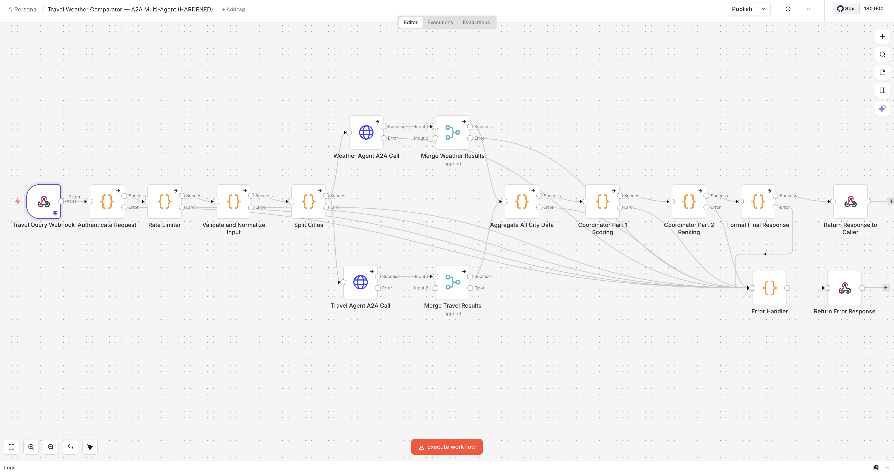

# Travel Weather Comparator — A2A Multi-Agent System (HARDENED)

> **Applied Agentic AI Program · Interview Kickstart · Spring 2026**  
> Lamonte Smith

A production-hardened, 16-node **Agent-to-Agent (A2A)** multi-agent workflow built in n8n that compares weather and travel logistics across multiple US cities. Designed with security-by-design principles across every layer of the request pipeline.

---



---

## Architecture Overview

```
Client Request
     │
     ▼
┌─────────────────────────────────────────────────────┐
│              SECURITY GATE (3 Layers)                │
│  Layer 1: API Key (X-Api-Key header)                 │
│  Layer 2: HMAC-SHA256 Body Signature                 │
│  Layer 3: CORS Origin Restriction                    │
└──────────────────────┬──────────────────────────────┘
                       │
                       ▼
            ┌─────────────────────┐
            │    Rate Limiter     │
            │  10 req/min sliding │
            │  window per client  │
            └──────────┬──────────┘
                       │
                       ▼
            ┌─────────────────────┐
            │  Input Validator    │
            │  Whitelist + Regex  │
            │  Cryptographic IDs  │
            └──────────┬──────────┘
                       │
                       ▼
            ┌─────────────────────┐
            │    Split Cities     │
            │  Fan-out (max 4)    │
            └──────┬──────┬───────┘
                   │      │
          ┌────────┘      └────────┐
          ▼                        ▼
  ┌───────────────┐      ┌─────────────────┐
  │ Weather Agent │      │  Travel Agent   │
  │  A2A Call     │      │  A2A Call       │
  │ Bearer Token  │      │  Bearer Token   │
  └───────┬───────┘      └────────┬────────┘
          │                       │
          ▼                       ▼
  ┌───────────────┐      ┌─────────────────┐
  │ Merge Weather │      │  Merge Travel   │
  │   Results     │      │    Results      │
  └───────┬───────┘      └────────┬────────┘
          └──────────┬────────────┘
                     ▼
          ┌─────────────────────┐
          │ Aggregate All City  │
          │       Data          │
          └──────────┬──────────┘
                     ▼
          ┌─────────────────────┐
          │  Coordinator Pt 1   │
          │     Scoring         │
          └──────────┬──────────┘
                     ▼
          ┌─────────────────────┐
          │  Coordinator Pt 2   │
          │      Ranking        │
          └──────────┬──────────┘
                     ▼
          ┌─────────────────────┐
          │  Format Response    │
          └──────────┬──────────┘
                     ▼
          ┌─────────────────────┐
          │  Return to Caller   │
          └─────────────────────┘
```

---

## Security Architecture

This workflow implements a **threat-modeled, hardened security posture** across 12 identified threat vectors:

| Threat | Remediation | Node |
|--------|------------|------|
| T-01: Unauthenticated access | 3-layer auth gate (API key + HMAC-SHA256 + CORS) | `Authenticate Request` |
| T-03: Injection via input fields | Whitelist validation, regex on dates, string sanitization | `Validate and Normalize Input` |
| T-04: Denial of service / flooding | Sliding-window rate limiter (10 req/60s) | `Rate Limiter` |
| T-06: Request replay / spoofing | Cryptographic UUID request IDs via `crypto.randomUUID()` | `Validate and Normalize Input` |
| T-07: Fan-out amplification | Hard cap of 4 cities per request | `Rate Limiter` + `Validate Input` |
| T-09: Cross-origin abuse | `allowedOrigins` enforced at webhook level | `Travel Query Webhook` |
| T-12: Timezone / timestamp leakage | All timestamps in UTC, no local timezone exposure | `Validate and Normalize Input` |
| Side-channel: Timing attacks | `crypto.timingSafeEqual()` for HMAC comparison | `Authenticate Request` |

### Security Headers (enforced on every response)
```
X-Content-Type-Options: nosniff
X-Frame-Options: DENY
Strict-Transport-Security: max-age=63072000; includeSubDomains; preload
Cache-Control: no-store
X-Request-Id: <cryptographic-uuid>
```

---

## Workflow Nodes (16)

| # | Node | Type | Purpose |
|---|------|------|---------|
| 1 | Travel Query Webhook | Webhook (POST) | Entry point — `/travel-weather-compare` |
| 2 | Authenticate Request | Code | 3-layer auth: API key + HMAC-SHA256 + CORS |
| 3 | Rate Limiter | Code | Sliding-window rate limiting + fan-out cap |
| 4 | Validate and Normalize Input | Code | Whitelist, regex, sanitization, crypto IDs |
| 5 | Split Cities | Code | Fan-out: one item per city |
| 6 | Weather Agent A2A Call | HTTP Request | A2A task dispatch to Weather Agent |
| 7 | Travel Agent A2A Call | HTTP Request | A2A task dispatch to Travel Agent |
| 8 | Merge Weather Results | Merge | Collect parallel weather responses |
| 9 | Merge Travel Results | Merge | Collect parallel travel responses |
| 10 | Aggregate All City Data | Code | Combine all agent results per city |
| 11 | Coordinator Part 1 Scoring | Code | Score each city on weather + travel metrics |
| 12 | Coordinator Part 2 Ranking | Code | Rank cities, apply budget mode logic |
| 13 | Format Final Response | Code | Structure output, strip internal fields |
| 14 | Return Response to Caller | Respond to Webhook | Send secured response |
| 15 | Error Handler | Code | Centralized error normalization |
| 16 | Return Error Response | Respond to Webhook | Sanitized error response |

---

## Supported Cities & Origins

**Destination Cities (whitelist-validated)**
`Austin` · `Miami` · `Denver` · `Chicago` · `New Orleans` · `San Francisco` · `Nashville`

**Origin Cities**
`NYC` · `LA` · `Chicago` · `Austin` · `Miami` · `Denver`

---

## A2A Protocol

Agent-to-Agent communication uses a standardized task envelope:

```json
{
  "task_id": "TWC-<uuid>-weather-<city>",
  "sender": "travel-coordinator",
  "task_type": "weather_forecast",
  "payload": {
    "city": "Austin",
    "days": 7,
    "units": "imperial"
  }
}
```

Each A2A call includes:
- `Authorization: Bearer <A2A_AGENT_TOKEN>`
- `X-A2A-Sender: travel-coordinator`
- `X-A2A-Task: <task-type>`
- `X-Request-Id: <propagated-uuid>`
- 10-second timeout with `allowUnauthorizedCerts: false`

---

## Environment Variables

```bash
TWC_API_KEY=          # Required: API key for authenticating inbound requests
TWC_HMAC_SECRET=      # Required: Secret for HMAC-SHA256 body signature verification
A2A_AGENT_TOKEN=      # Required: Bearer token for outbound A2A agent calls
WEATHER_AGENT_URL=    # Required: URL of the Weather Agent service
TRAVEL_AGENT_URL=     # Required: URL of the Travel Agent service
```

> ⚠️ Never commit actual values. Use n8n environment variable management or a secrets manager.

---

## Sample Request

```bash
curl -X POST https://<your-n8n-instance>/webhook/travel-weather-compare \
  -H "Content-Type: application/json" \
  -H "X-Api-Key: <your-api-key>" \
  -H "X-Hmac-Signature: <sha256-hmac-of-body>" \
  -d '{
    "cities": ["Austin", "Miami", "Denver"],
    "origin": "NYC",
    "travel_date": "2026-06-15",
    "budget_mode": false
  }'
```

---

## Tech Stack


**Protocols:** A2A (Agent-to-Agent) · REST · HMAC-SHA256  
**Security:** API Key Auth · HMAC Signatures · CORS · Rate Limiting · Input Sanitization · Timing-Safe Comparison  
**Patterns:** Fan-out/Fan-in · Coordinator-Worker · Centralized Error Handling

---

## Academic Context

| Field | Detail |
|-------|--------|
| Program | Applied Agentic AI |
| Institution | Interview Kickstart |
| Semester | Spring 2026 |
| Assignment | Multi-Agent A2A Workflow Capstone |

---

## Repository Structure

```
travel-weather-comparator/
├── workflow/
│   └── Travel_Weather_Comparator_A2A_HARDENED.json   # n8n export
├── docs/
│   └── architecture.md                                # Extended design notes
├── SECURITY.md                                        # Security policy
└── README.md
```

---

## License

MIT License — see [LICENSE](LICENSE)

---

<div align="center">
<sub>Built by <a href="https://github.com/LSmithPMP">Lamonte Smith</a> · Applied Agentic AI · Interview Kickstart</sub>
</div>
